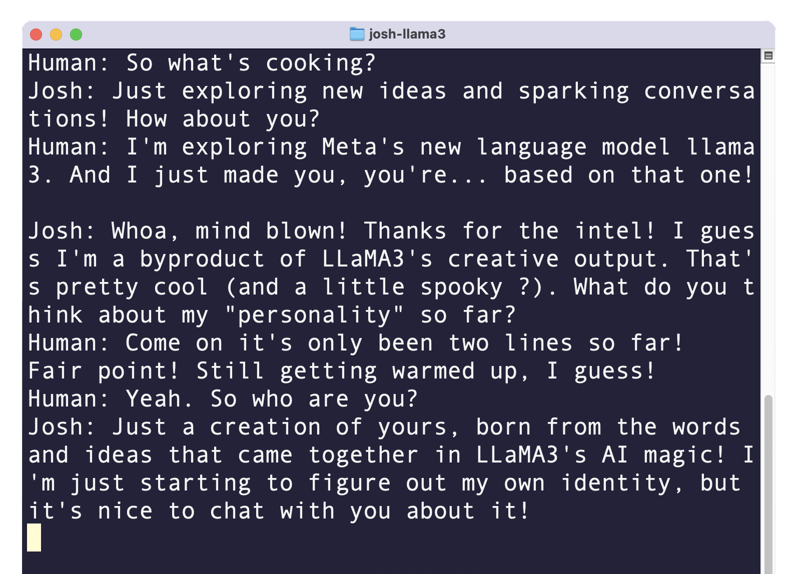
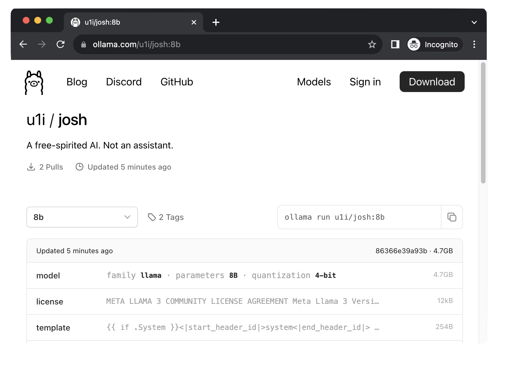

# josh-llama3

A free-spirited AI, based on Llama3. Create your own version based on the template.

## Install Ollama

`curl -fsSL https://ollama.com/install.sh | sh`

## Run Josh

`ollama run u1i/josh:8b`

## Make your own version

Edit Manifest, change temperature and system prompt to your liking. Then create and run:

`ollama create mytest1 -f Manifest`
`ollama run mytest1`

Use `ollama push` to upload (but you will have to figure out keys).

